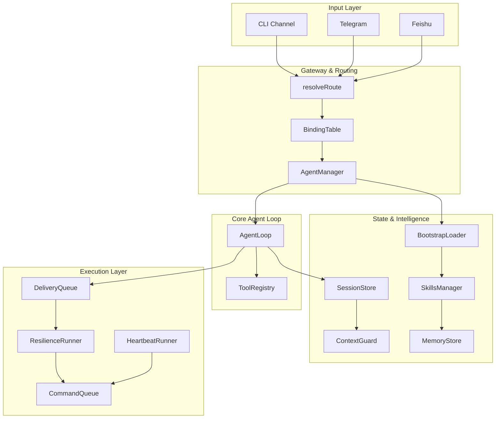

# 00-architecture-overview

The shrimp-agent SDK implements a provider-agnostic AI agent gateway with 11 modules that progress from core agent loops to production-ready features. The system handles message routing across channels, session persistence, intelligent prompt assembly, reliable delivery, and resilient execution with concurrent task lanes.

## System Diagram

## 1. Module Dependency Chain

| # | Module | Foundation For |
|---|--------|----------------|
| 00 | types.ts | All modules |
| 01 | agent-loop | gateway, resilience |
| 02 | tool-use | agent-loop |
| 03 | sessions | gateway, intelligence |
| 04 | channels | gateway |
| 05 | gateway | All high-level modules |
| 06 | intelligence | gateway |
| 07 | heartbeat | workspace |
| 08 | delivery | channels |
| 09 | resilience | agent-loop wrapper |
| 10 | concurrency | All execution |
| 11 | workspace | Top-level config |
| 12 | providers | agent-loop input |

## 2. Message Flow

| Stage | Module | Action |
|-------|--------|--------|
| Receive | Channel | Poll webhook or stdin for inbound message |
| Route | Gateway | Resolve agent and session key via BindingTable |
| Persist | SessionStore | Load/create session, append message |
| Assemble | Intelligence | Build system prompt from workspace files |
| Execute | AgentLoop | Run while loop with tool dispatch |
| Guard | ContextGuard | Retry with truncation then summarization |
| Deliver | DeliveryQueue | Queue response with exponential backoff |
| Resilience | ResilienceRunner | Auth rotation, overflow recovery, fallback |

## 3. Session Key Format

| Scope | Format | Use Case |
|-------|--------|----------|
| main | `agent:{id}:main` | Single shared session |
| per-peer | `agent:{id}:direct:{peerId}` | One session per user |
| per-channel-peer | `agent:{id}:{channel}:direct:{peerId}` | User+channel isolation |
| per-account-channel-peer | `agent:{id}:{channel}:{account}:direct:{peerId}` | Full isolation |

## File Reference

| File | Purpose |
|------|---------|
| `src/types.ts` | Shared type definitions |
| `src/index.ts` | Barrel export for all modules |
| `src/providers/azure-openai.ts` | Azure OpenAI provider implementation |

## Cross-References

| Doc | Relation |
|-----|----------|
| [01-core-loop](01-core-loop.md) | Agent execution foundation |
| [02-tool-system](02-tool-system.md) | Tool dispatch mechanism |
| [05-gateway-routing](05-gateway-routing.md) | Route resolution logic |
