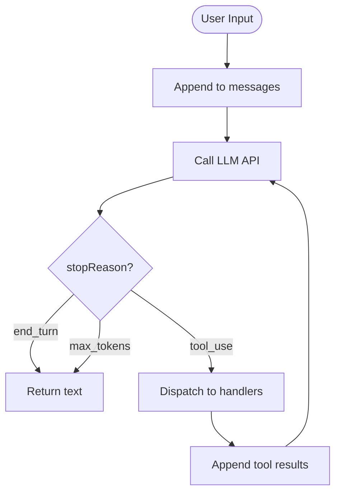

# 01-core-loop

The AgentLoop module implements the fundamental agent execution pattern: a while loop that sends messages to an LLM and checks the stopReason to either return text or dispatch tools and continue. This is the foundation that all other modules build upon.

## System Diagram

## 1. Loop Configuration

| Option | Type | Default | Purpose |
|--------|------|---------|---------|
| provider | LLMProvider | required | LLM API client |
| model | string | required | Model identifier |
| systemPrompt | string | required | System prompt |
| maxTokens | number | 8096 | Max tokens per response |
| maxIterations | number | 15 | Max loop iterations |
| tools | ToolDefinition[] | [] | Available tools |
| toolHandlers | Map | {} | Tool name to handler |
| onToolCall | function | undefined | Callback for tool calls |

## 2. Stop Reasons

| Reason | Action |
|--------|--------|
| end_turn | Return response text to caller |
| tool_use | Execute tools, append results, continue loop |
| max_tokens | Return partial response |

## 3. Content Block Types

| Type | Fields | Purpose |
|------|--------|---------|
| text | text: string | Plain text output |
| tool_use | id, name, input | Model requests tool execution |
| tool_result | tool_use_id, content | Handler output fed back to model |

## File Reference

| File | Purpose |
|------|---------|
| `src/agent-loop.ts` | AgentLoop class, extractText utility |
| `src/types.ts` | LLMProvider, Message, ContentBlock interfaces |

## Cross-References

| Doc | Relation |
|-----|----------|
| [00-architecture](00-architecture-overview.md) | Parent context |
| [02-tool-system](02-tool-system.md) | Tool dispatch mechanism |
| [09-resilience](09-resilience.md) | Wraps loop with retry logic |
