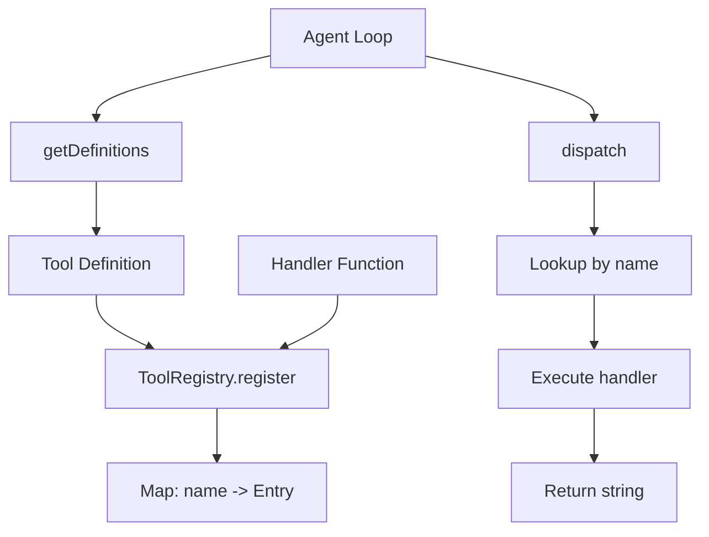

# 02-tool-system

The ToolRegistry module pairs tool schemas with handler functions so the agent loop can dispatch tool calls by name. The model receives JSON schema descriptions, and the registry maps tool names to executable handlers.

## System Diagram

## 1. ToolEntry Structure

| Field | Type | Purpose |
|-------|------|---------|
| definition | ToolDefinition | JSON Schema for model |
| handler | ToolHandler | Executable function |

## 2. ToolDefinition Schema

| Field | Type | Required | Description |
|-------|------|----------|-------------|
| name | string | Yes | Unique identifier |
| description | string | Yes | What the tool does |
| input_schema | Record | Yes | JSON Schema for validation |

## 3. Registry Methods

| Method | Returns | Purpose |
|--------|---------|---------|
| register(definition, handler) | void | Add tool to registry |
| unregister(name) | boolean | Remove tool |
| getDefinition(name) | ToolDefinition\|undefined | Get schema for one tool |
| getDefinitions() | ToolDefinition[] | Get all schemas for LLM |
| getHandler(name) | ToolHandler\|undefined | Get executor for one tool |
| getHandlers() | Map<string, ToolHandler> | Get all for AgentLoop |
| dispatch(name, input) | Promise<string> | Execute tool by name |
| has(name) | boolean | Check if tool exists |
| names() | string[] | List all tool names |
| size | number | Count of registered tools |

## File Reference

| File | Purpose |
|------|---------|
| `src/tool-use.ts` | ToolRegistry class |
| `src/types.ts` | ToolDefinition, ToolHandler, ToolEntry types |

## Cross-References

| Doc | Relation |
|-----|----------|
| [00-architecture](00-architecture-overview.md) | Parent context |
| [01-core-loop](01-core-loop.md) | Uses registry for tool dispatch |
