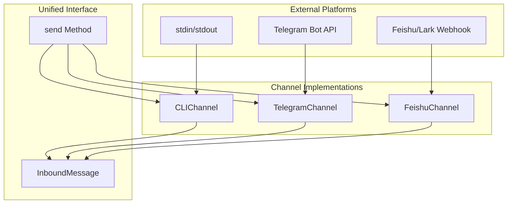

# 04-channels

The Channel module abstracts platform differences so the agent loop sees a unified InboundMessage format. Implement receive() and send() for each platform: CLI (stdin/stdout), Telegram (Bot API), Feishu (Lark/Feishu webhooks).

## System Diagram

## 1. Channel Interface

| Method | Returns | Purpose |
|--------|---------|---------|
| receive() | Promise<InboundMessage\|null> | Poll for next message |
| send(to, text) | Promise<boolean> | Deliver message to peer |
| close() | void | Cleanup resources |

## 2. InboundMessage Fields

| Field | Type | Purpose |
|-------|------|---------|
| text | string | Message content |
| senderId | string | User identifier |
| channel | string | Platform name |
| accountId | string | Bot account identifier |
| peerId | string | Conversation identifier |
| isGroup | boolean | Group chat flag |
| media | array | Attached media metadata |
| raw | Record | Original platform payload |

## 3. Channel Implementations

| Channel | name | accountId | Receive Method | Send Method |
|---------|------|-----------|----------------|-------------|
| CLIChannel | "cli" | "cli-local" | stdin readline | stdout write |
| TelegramChannel | "telegram" | from config | long-poll getUpdates | sendMessage API |
| FeishuChannel | "feishu" | from config | parseEvent webhook | im/v1/messages API |

## 4. ChannelManager Methods

| Method | Purpose |
|--------|---------|
| register(channel) | Add channel to registry |
| get(name) | Retrieve channel by name |
| listChannels() | Get all registered channel names |
| closeAll() | Cleanup all channels |

## 5. Platform-Specific Limits

| Platform | Max Message Length | Chunk Strategy |
|----------|-------------------|----------------|
| Telegram | 4096 chars | Split at newlines |
| Feishu/Lark | No hard limit | Send as-is |

## File Reference

| File | Purpose |
|------|---------|
| `src/channels.ts` | Channel abstract class, implementations |

## Cross-References

| Doc | Relation |
|-----|----------|
| [00-architecture](00-architecture-overview.md) | Parent context |
| [05-gateway-routing](05-gateway-routing.md) | Uses channels for routing |
| [08-delivery](08-delivery.md) | Sends through channels |
