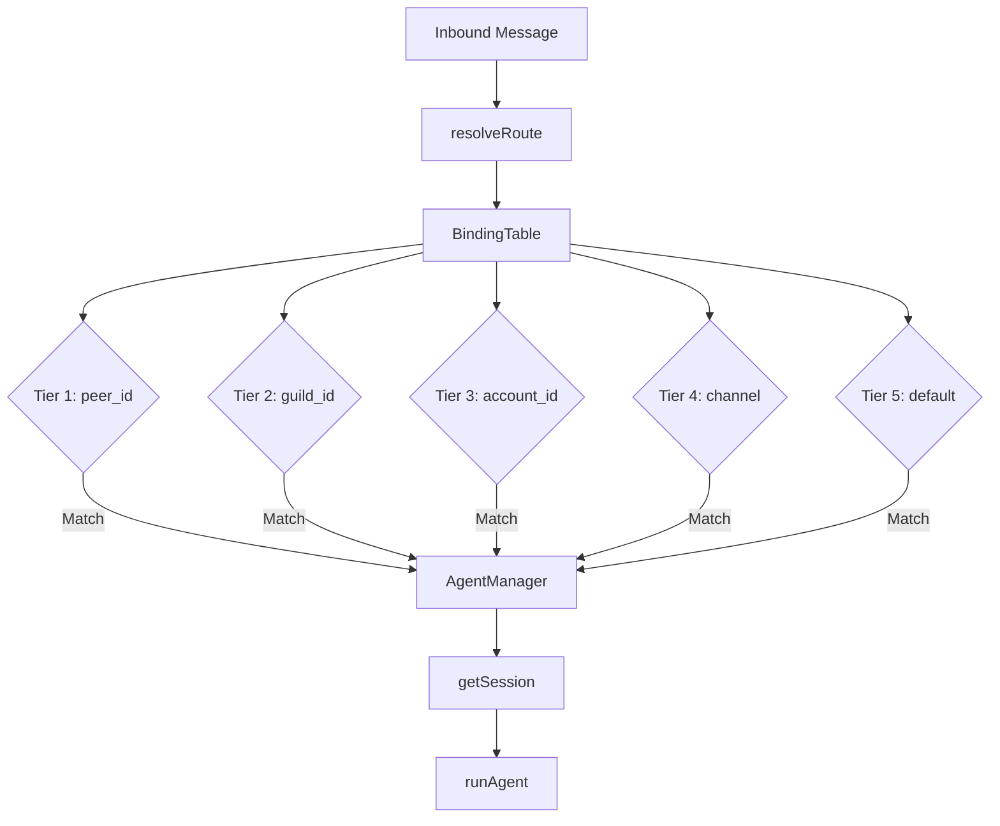

# 05-gateway-routing

The Gateway module implements 5-tier route resolution that maps inbound messages to specific agents based on peer, guild, account, channel, or default bindings. AgentManager stores agent configurations and session memory per routing key.

## System Diagram

## 1. Binding Structure

| Field | Type | Purpose |
|-------|------|---------|
| agentId | string | Target agent identifier |
| tier | number | 1-5, priority order |
| matchKey | string | "peer_id"\|"guild_id"\|"account_id"\|"channel"\|"default" |
| matchValue | string | Value to match against |
| priority | number | Within tier, higher wins |

## 2. 5-Tier Resolution Order

| Tier | matchKey | Example matchValue | Use Case |
|------|----------|-------------------|----------|
| 1 | peer_id | "123456" or "telegram:123456" | Specific user across platforms |
| 2 | guild_id | "-987654321" | Discord server or Telegram group |
| 3 | account_id | "bot-prod" | Specific bot account |
| 4 | channel | "telegram" | All messages on platform |
| 5 | default | "*" | Fallback for unmatched |

## 3. DmScope Options

| Scope | Session Key Format | Isolation Level |
|-------|-------------------|-----------------|
| main | `agent:{id}:main` | All users share one session |
| per-peer | `agent:{id}:direct:{peerId}` | One session per user |
| per-channel-peer | `agent:{id}:{channel}:direct:{peerId}` | User+platform isolation |
| per-account-channel-peer | `agent:{id}:{channel}:{account}:direct:{peerId}` | Full isolation |

## 4. AgentConfig Fields

| Field | Type | Required | Default |
|-------|------|----------|---------|
| id | string | Yes | - |
| name | string | Yes | - |
| personality | string | No | - |
| model | string | No | from defaultModel |
| dmScope | DmScope | No | "per-peer" |

## 5. AgentManager Methods

| Method | Returns | Purpose |
|--------|---------|---------|
| register(config) | void | Add agent config |
| getAgent(agentId) | AgentConfig\|undefined | Retrieve config |
| listAgents() | AgentConfig[] | All registered agents |
| getSession(sessionKey) | Message[] | Get or create session |
| listSessions(agentId?) | Record | Session stats |

## File Reference

| File | Purpose |
|------|---------|
| `src/gateway.ts` | BindingTable, AgentManager, route resolution |

## Cross-References

| Doc | Relation |
|-----|----------|
| [00-architecture](00-architecture-overview.md) | Parent context |
| [01-core-loop](01-core-loop.md) | runAgent uses AgentLoop |
| [03-session-persistence](03-session-persistence.md) | Session storage |
| [04-channels](04-channels.md) | Input for routing |
