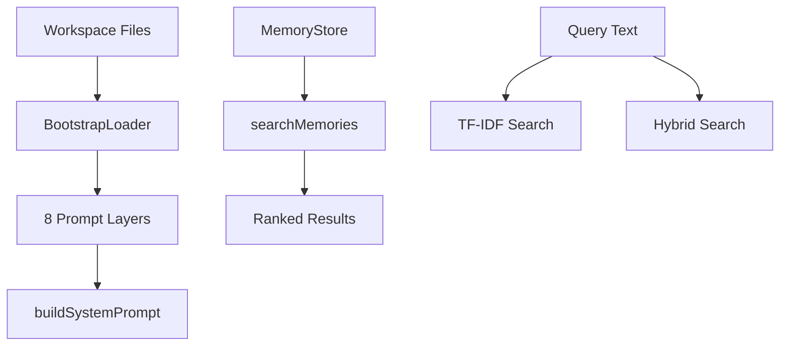

# 06-intelligence

The Intelligence module assembles 8-layer system prompts from workspace files and provides TF-IDF + hybrid search for memory retrieval. BootstrapLoader reads SOUL.md, IDENTITY.md, SKILLS.md and other workspace files to build agent personality and capabilities.

## System Diagram

## 1. 8 Prompt Layers (buildSystemPrompt)

| Layer | File | Purpose |
|-------|------|---------|
| 1 | SOUL.md | Core essence and values |
| 2 | IDENTITY.md | Name, role, personality |
| 3 | USER.md | Target audience definition |
| 4 | SKILLS.md | Capabilities and constraints |
| 5 | TOOLS.md | Available tool descriptions |
| 6 | HEARTBEAT.md | Proactive behaviors |
| 7 | MEMORY.md | Important context to remember |
| 8 | AGENTS.md | Multi-agent coordination |

## 2. BootstrapLoader Methods

| Method | Returns | Purpose |
|--------|---------|---------|
| loadFile(name) | Promise<string> | Read workspace file |
| loadAll() | Promise<Record> | Load all workspace files |
| exists(name) | boolean | Check file exists |
| listLoaded() | string[] | Names of loaded files |

## 3. SkillsManager Methods

| Method | Returns | Purpose |
|--------|---------|---------|
| parse(text) | Skill[] | Parse SKILLS.md format |
| format(skills) | string | Convert to prompt section |
| validate(skills) | string[] | Return validation errors |

## 4. Skill Structure

| Field | Type | Purpose |
|-------|------|---------|
| name | string | Skill identifier |
| description | string | What the skill does |
| can | string[] | Capabilities list |
| cannot | string[] | Constraints list |

## 5. MemoryStore Search Types

| Type | Algorithm | Best For |
|------|-----------|----------|
| tfidf | Term frequency, inverse doc frequency | Keyword matching |
| hybrid | TF-IDF + semantic combo | Balancing precision/recall |

## 6. MemoryEntry Fields

| Field | Type | Purpose |
|-------|------|---------|
| id | string | Unique identifier |
| content | string | Memory text |
| embedding | number[] | Vector for semantic search |
| metadata | Record | Additional info |
| createdAt | string | ISO timestamp |

## 7. MemorySearchResult Structure

| Field | Type | Purpose |
|-------|------|---------|
| entry | MemoryEntry | Matched memory |
| score | number | Relevance 0-1 |

## File Reference

| File | Purpose |
|------|---------|
| `src/intelligence.ts` | BootstrapLoader, SkillsManager, MemoryStore |

## Cross-References

| Doc | Relation |
|-----|----------|
| [00-architecture](00-architecture-overview.md) | Parent context |
| [11-workspace](11-workspace.md) | Workspace file loading |
