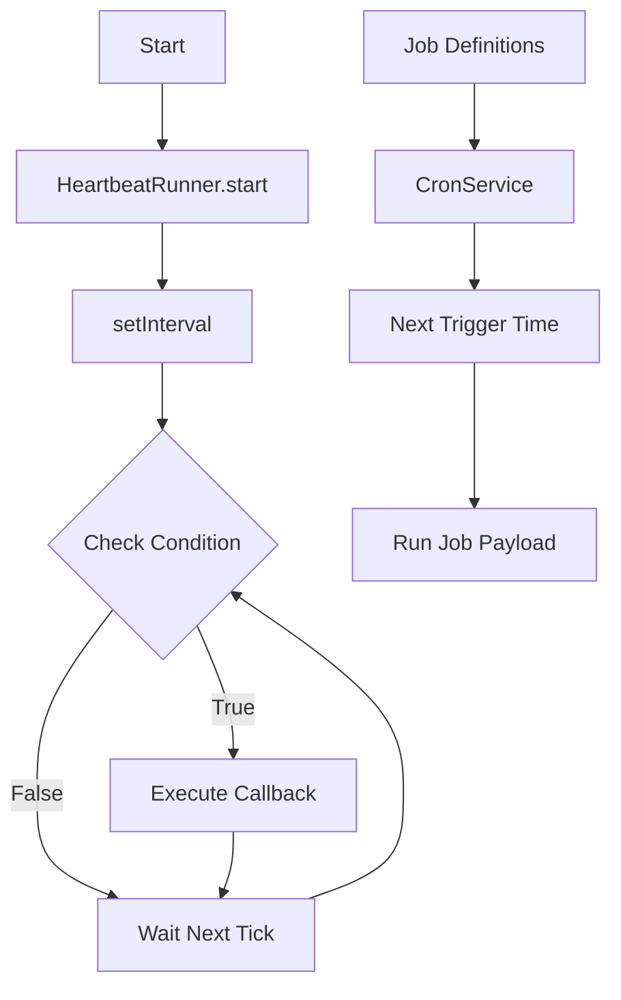

# 07-heartbeat

The Heartbeat module enables proactive agent behaviors through timer-based checks and scheduled cron jobs. HeartbeatRunner executes periodic functions, and CronService manages time-based triggers with at, every, and cron expression scheduling.

## System Diagram

## 1. HeartbeatRunner Options

| Option | Type | Default | Purpose |
|--------|------|---------|---------|
| intervalMs | number | 60000 | Check frequency in milliseconds |
| onTick | function | required | Called each interval |

## 2. HeartbeatRunner Methods

| Method | Returns | Purpose |
|--------|---------|---------|
| start() | void | Begin timer |
| stop() | void | Clear timer |
| isRunning() | boolean | Check active state |

## 3. CronSchedule Types

| Type | Field | Example |
|------|-------|---------|
| at | at | "2024-03-20T14:30:00Z" |
| every | everySeconds, anchor | 3600, "09:00" |
| cron | expr | "0 9 * * 1-5" (9am weekdays) |

## 4. CronJobDefinition Fields

| Field | Type | Purpose |
|-------|------|---------|
| id | string | Unique job identifier |
| name | string | Human-readable name |
| enabled | boolean | Whether job is active |
| schedule | CronSchedule | When to trigger |
| payload | object | Job payload (kind, text, etc.) |
| deleteAfterRun | boolean | Auto-delete after execution |

## 5. CronService Options

| Option | Type | Default | Purpose |
|--------|------|---------|---------|
| jobs | CronJobDefinition[] | [] | Initial job list |
| onTrigger | function | required | Called when job fires |
| timezone | string | "UTC" | Timezone for scheduling |

## 6. CronService Methods

| Method | Returns | Purpose |
|--------|---------|---------|
| add(job) | void | Register new job |
| remove(id) | boolean | Delete job by ID |
| get(id) | CronJobDefinition\|undefined | Get job config |
| list() | CronJobDefinition[] | All jobs |
| start() | void | Begin scheduler |
| stop() | void | Stop scheduler |

## File Reference

| File | Purpose |
|------|---------|
| `src/heartbeat.ts` | HeartbeatRunner, CronService classes |

## Cross-References

| Doc | Relation |
|-----|----------|
| [00-architecture](00-architecture-overview.md) | Parent context |
| [10-concurrency](10-concurrency.md) | Runs in LANE_HEARTBEAT |
