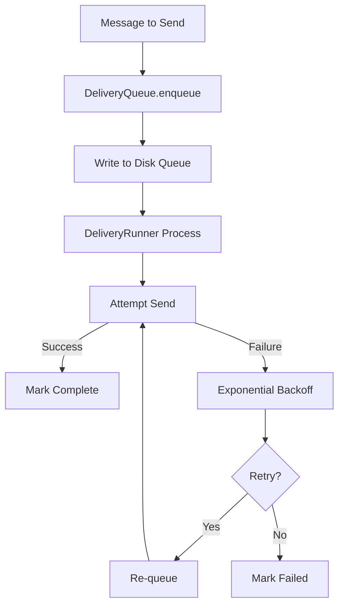

# 08-delivery

The Delivery module implements a write-ahead queue with exponential backoff retry for reliable message delivery. Messages are persisted to disk before sending, ensuring no loss on process restart.

## System Diagram

## 1. QueuedDeliveryData Structure

| Field | Type | Purpose |
|-------|------|---------|
| id | string | Unique delivery ID |
| channel | string | Target channel name |
| to | string | Recipient identifier |
| text | string | Message content |
| retryCount | number | Attempt counter |
| lastError | string\|null | Last failure reason |
| enqueuedAt | number | Unix timestamp |
| nextRetryAt | number | Unix timestamp |

## 2. DeliveryQueue Methods

| Method | Returns | Purpose |
|--------|---------|---------|
| enqueue(channel, to, text) | string | Queue message, return ID |
| dequeue() | QueuedDeliveryData[] | Get pending items |
| markComplete(id) | void | Remove from queue |
| markFailed(id, error) | void | Record failure, stop retrying |
| requeue(id, nextRetryAt) | void | Schedule retry |
| getStats() | object | Queue statistics |

## 3. Exponential Backoff

| Attempt | Delay Formula |
|---------|---------------|
| 0 | 0ms (immediate) |
| 1 | 1000ms (1 second) |
| 2 | 2000ms (2 seconds) |
| 3 | 4000ms (4 seconds) |
| n | min(1000 * 2^n, 60000) max 60s |

## 4. DeliveryRunner Options

| Option | Type | Default | Purpose |
|--------|------|---------|---------|
| queue | DeliveryQueue | required | Queue to process |
| deliverFn | DeliverFn | required | Send function |
| maxConcurrent | number | 5 | Parallel sends |
| pollIntervalMs | number | 1000 | Check frequency |

## 5. DeliveryRunner Methods

| Method | Returns | Purpose |
|--------|---------|---------|
| start() | void | Begin processing |
| stop() | Promise<void> | Drain queue and stop |
| isRunning() | boolean | Check active state |

## 6. Platform Chunking

| Platform | Max Length | Chunk Function |
|----------|------------|----------------|
| Telegram | 4096 | chunkMessage(text, 4096) |
| Feishu | No limit | No chunking |
| CLI | No limit | No chunking |

## File Reference

| File | Purpose |
|------|---------|
| `src/delivery.ts` | DeliveryQueue, DeliveryRunner, utilities |

## Cross-References

| Doc | Relation |
|-----|----------|
| [00-architecture](00-architecture-overview.md) | Parent context |
| [04-channels](04-channels.md) | Uses channels for delivery |
| [09-resilience](09-resilience.md) | Delivery retry logic |
