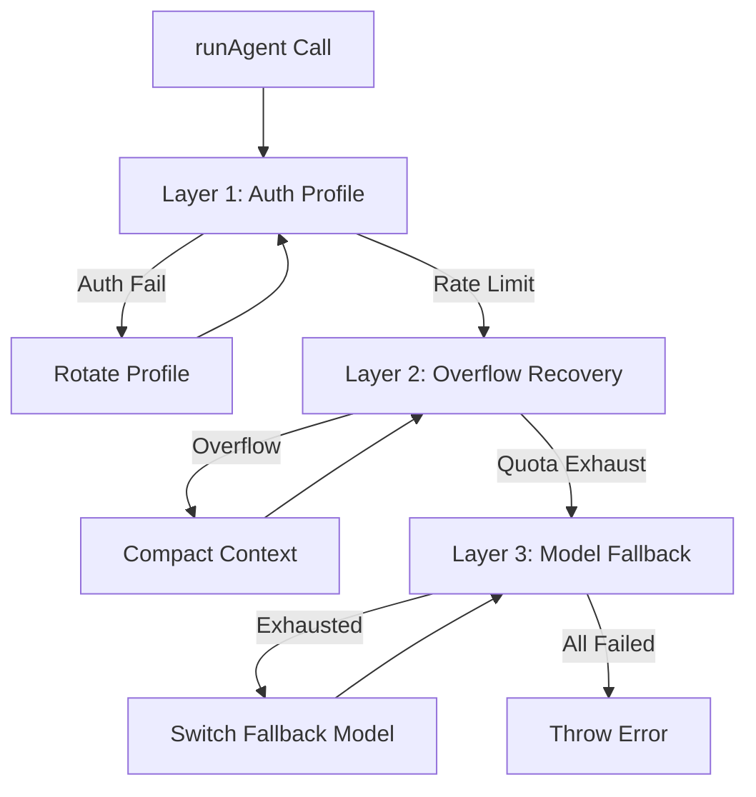

# 09-resilience

The Resilience module wraps LLM calls with a 3-layer retry onion: auth profile rotation on authentication failures, context overflow recovery, and model fallback on quota exhaustion.

## System Diagram

## 1. FailoverReason Classifications

| Reason | Trigger Pattern |
|--------|-----------------|
| rate_limit | "rate", "limit", "429" |
| auth | "auth", "unauthorized", "401" |
| timeout | "timeout", "timed out" |
| billing | "billing", "quota", "credit" |
| overflow | "context", "token", "too large" |
| unknown | Catch-all |

## 2. AuthProfileData Structure

| Field | Type | Purpose |
|-------|------|---------|
| name | string | Profile identifier |
| provider | string | "anthropic", "openai", etc. |
| apiKey | string | API key or token |
| baseUrl | string\|undefined | Custom endpoint |

## 3. ProfileManager Methods

| Method | Returns | Purpose |
|--------|---------|---------|
| add(profile) | void | Register auth profile |
| remove(name) | boolean | Delete profile |
| get(name) | AuthProfile\|undefined | Retrieve profile |
| rotate(excludeName) | AuthProfile\|undefined | Get next available |
| list() | AuthProfile[] | All profiles |

## 4. ResilienceRunner Options

| Option | Type | Default | Purpose |
|--------|------|---------|---------|
| profileManager | ProfileManager | required | Auth profile pool |
| providerFactory | ProviderFactory | required | Create provider from profile |
| modelId | string | required | Primary model |
| fallbackModels | string[] | [] | Backup models |
| maxToolLoopIterations | number | 15 | Agent loop limit |

## 5. ResilienceRunner Retry Layers

| Layer | Condition | Action |
|-------|-----------|--------|
| 1 | Auth failure | Rotate to next profile |
| 1 | Rate limit | Wait with exponential backoff |
| 2 | Context overflow | Trigger ContextGuard.compactHistory |
| 3 | Quota exhausted | Switch to fallbackModels[0] |

## 6. ResilienceStats Structure

| Field | Type | Purpose |
|-------|------|---------|
| totalAttempts | number | Total API calls |
| authRotations | number | Profile switches |
| overflows | number | Context overflows |
| fallbacks | number | Model downgrades |

## File Reference

| File | Purpose |
|------|---------|
| `src/resilience.ts` | classifyFailure, AuthProfile, ProfileManager, ResilienceRunner |

## Cross-References

| Doc | Relation |
|-----|----------|
| [00-architecture](00-architecture-overview.md) | Parent context |
| [01-core-loop](01-core-loop.md) | Wraps AgentLoop with resilience |
| [03-session-persistence](03-session-persistence.md) | ContextGuard for overflow |
| [12-providers](12-providers.md) | Provider interface |
