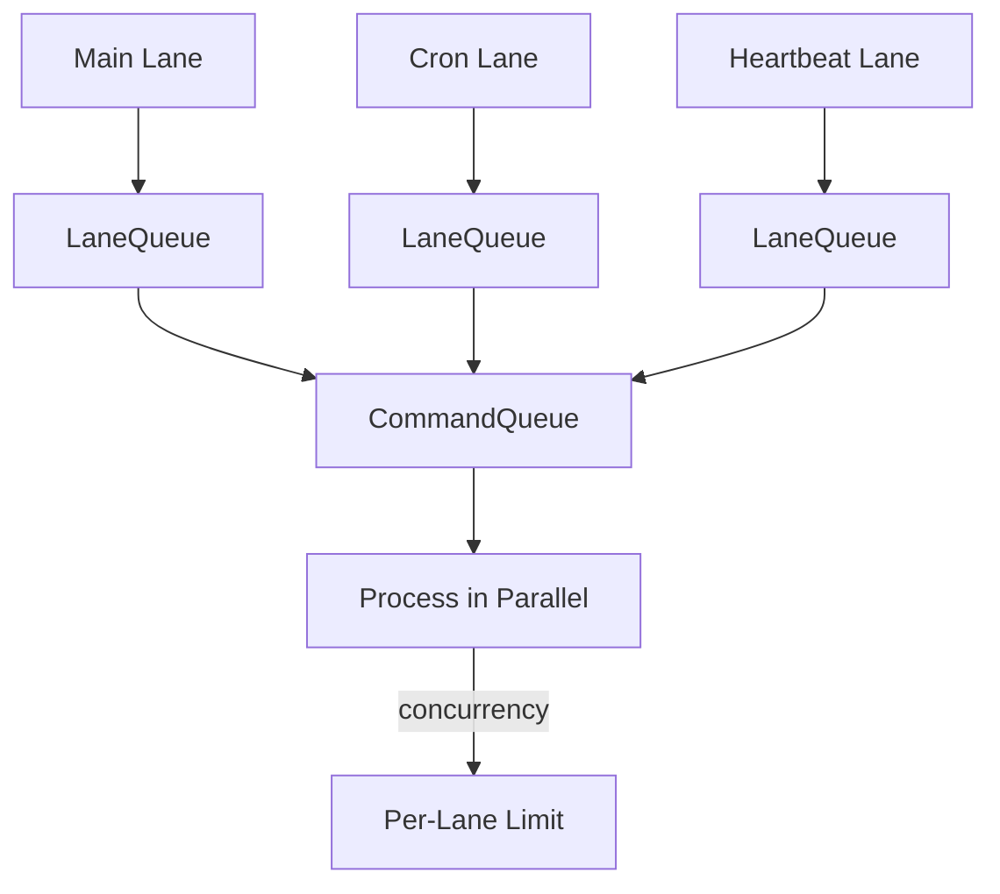

# 10-concurrency

The Concurrency module provides named FIFO lanes with configurable concurrency limits and generation tracking. CommandQueue manages multiple LaneQueue instances for isolating different types of work (user messages, cron jobs, heartbeat checks).

## System Diagram

## 1. Predefined Lanes

| Constant | Value | Purpose |
|----------|-------|---------|
| LANE_MAIN | "main" | User message processing |
| LANE_CRON | "cron" | Scheduled task execution |
| LANE_HEARTBEAT | "heartbeat" | Proactive agent checks |

## 2. LaneQueue Options

| Option | Type | Default | Purpose |
|--------|------|---------|---------|
| name | string | required | Lane identifier |
| concurrency | number | 1 | Max parallel tasks |

## 3. LaneQueue Methods

| Method | Returns | Purpose |
|--------|---------|---------|
| enqueue(fn) | Promise<T> | Add task to lane |
| getStats() | LaneStats | Queue statistics |

## 4. LaneStats Structure

| Field | Type | Purpose |
|-------|------|---------|
| pending | number | Tasks waiting |
| running | number | Tasks executing |
| completed | number | Tasks finished |
| generation | number | Queue generation ID |

## 5. CommandQueue Methods

| Method | Returns | Purpose |
|--------|---------|---------|
| register(lane) | void | Add named lane |
| enqueue(laneName, fn) | Promise<T> | Submit task to lane |
| getStats(laneName) | LaneStats\|undefined | Get lane stats |
| waitForAll() | Promise<void> | Wait for all lanes to drain |
| clear(laneName?) | void | Cancel pending tasks |

## 6. Concurrency Examples

| Lane | Concurrency | Use Case |
|------|-------------|----------|
| main | 1 | Serial user message processing |
| cron | 3 | Parallel scheduled jobs |
| heartbeat | 1 | Single proactive check |
| background | 5 | Parallel async work |

## File Reference

| File | Purpose |
|------|---------|
| `src/concurrency.ts` | LaneQueue, CommandQueue, lane constants |

## Cross-References

| Doc | Relation |
|-----|----------|
| [00-architecture](00-architecture-overview.md) | Parent context |
| [07-heartbeat](07-heartbeat.md) | Uses LANE_HEARTBEAT |
