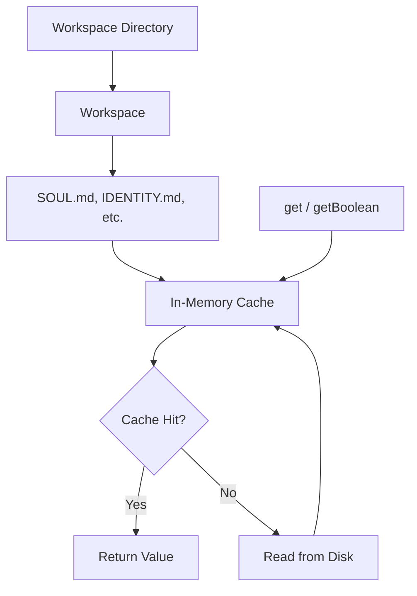

# 11-workspace

The Workspace module manages the loading and caching of agent configuration files from a directory structure. It provides centralized access to personality, skills, memory, and other prompt-building files.

## System Diagram



## 1. Workspace Directory Structure

```
{workspaceDir}/
├── .shrimp/
│   ├── SOUL.md
│   ├── IDENTITY.md
│   ├── USER.md
│   ├── SKILLS.md
│   ├── TOOLS.md
│   ├── HEARTBEAT.md
│   ├── MEMORY.md
│   ├── AGENTS.md
│   └── BOOTSTRAP.md
└── (other project files)
```

## 2. Workspace Options

| Option | Type | Default | Purpose |
|--------|------|---------|---------|
| workspaceDir | string | required | Path to workspace root |
| shrimpDir | string | ".shrimp" | Configuration subdirectory |

## 3. Workspace Methods

| Method | Returns | Purpose |
|--------|---------|---------|
| get(name) | Promise<string\|null> | Read file content |
| getBoolean(name) | Promise<boolean> | Parse true/false |
| exists(name) | boolean | Check file exists |
| getPath(name) | string | Get full file path |
| reload(name) | Promise<void> | Invalidate cache |
| reloadAll() | Promise<void> | Clear entire cache |
| list() | string[] | All config file names |

## 4. Standard Workspace Files

| File | Purpose | Format |
|------|---------|--------|
| SOUL.md | Core essence and values | Markdown |
| IDENTITY.md | Agent name and personality | Markdown |
| USER.md | Target audience | Markdown |
| SKILLS.md | Capabilities list | Structured sections |
| TOOLS.md | Tool descriptions | Markdown |
| HEARTBEAT.md | Proactive behaviors | Markdown |
| MEMORY.md | Important context | Markdown |
| AGENTS.md | Multi-agent setup | Markdown |
| BOOTSTRAP.md | Initialization config | Markdown |

## 5. Workspace Metadata

| Field | Type | Purpose |
|-------|------|---------|
| workspaceDir | string | Absolute path |
| shrimpDir | string | Config subdirectory name |
| fileCount | number | Number of config files |
| lastReload | number | Cache clear timestamp |

## 6. Caching Behavior

| Operation | Cache Behavior |
|-----------|----------------|
| get(name) | Returns cached if exists, else reads disk |
| getBoolean(name) | Same as get, parses "true"/"false" |
| reload(name) | Deletes cache entry, next get re-reads |
| reloadAll() | Clears entire cache map |

## File Reference

| File | Purpose |
|------|---------|
| `src/workspace.ts` | Workspace class |

## Cross-References

| Doc | Relation |
|-----|----------|
| [00-architecture](00-architecture-overview.md) | Parent context |
| [06-intelligence](06-intelligence.md) | Uses workspace for prompt building |
