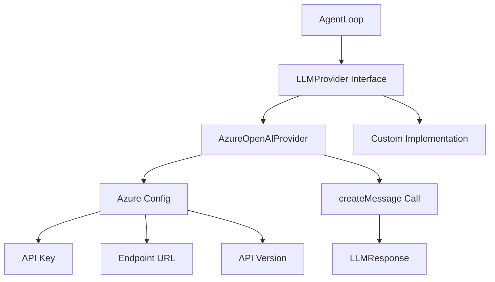

# 12-providers

The Providers module implements LLM provider clients. AzureOpenAIProvider provides a ready-to-use implementation for Microsoft Azure's OpenAI service with configurable API version and endpoint.

## System Diagram



## 1. LLMProvider Interface

| Method | Parameters | Returns |
|--------|------------|---------|
| createMessage | {model, maxTokens, system, messages, tools?} | Promise<LLMResponse> |

## 2. LLMResponse Structure

| Field | Type | Purpose |
|-------|------|---------|
| content | ContentBlock[] | Model output blocks |
| stopReason | string | "end_turn", "tool_use", "max_tokens", or other |

## 3. AzureOpenAIProvider Config

| Field | Type | Required | Default |
|-------|------|----------|---------|
| apiKey | string | Yes | - |
| endpoint | string | Yes | - |
| apiVersion | string | No | "2024-08-01-preview" |

## 4. AzureOpenAIProvider Methods

| Method | Returns | Purpose |
|--------|---------|---------|
| createMessage(params) | Promise<LLMResponse> | Call Azure OpenAI API |

## 5. ContentBlock Types

| Type | Fields |
|------|--------|
| text | {type: "text", text: string} |
| tool_use | {type: "tool_use", id, name, input} |
| tool_result | {type: "tool_result", tool_use_id, content} |

## 6. Provider Factory Pattern

```typescript
type ProviderFactory = (profile: AuthProfile) => LLMProvider;
```

| Purpose | Used By |
|----------|---------|
| Create provider from auth profile | ResilienceRunner |

## 7. Built-in Providers

| Provider | Class | Factory |
|----------|-------|---------|
| Azure OpenAI | AzureOpenAIProvider | createAzureOpenAIProvider(config) |

## File Reference

| File | Purpose |
|------|---------|
| `src/providers/azure-openai.ts` | Azure OpenAI implementation |
| `src/types.ts` | LLMProvider interface definition |

## Cross-References

| Doc | Relation |
|-----|----------|
| [00-architecture](00-architecture-overview.md) | Parent context |
| [01-core-loop](01-core-loop.md) | AgentLoop uses provider |
| [09-resilience](09-resilience.md) | providerFactory pattern |
